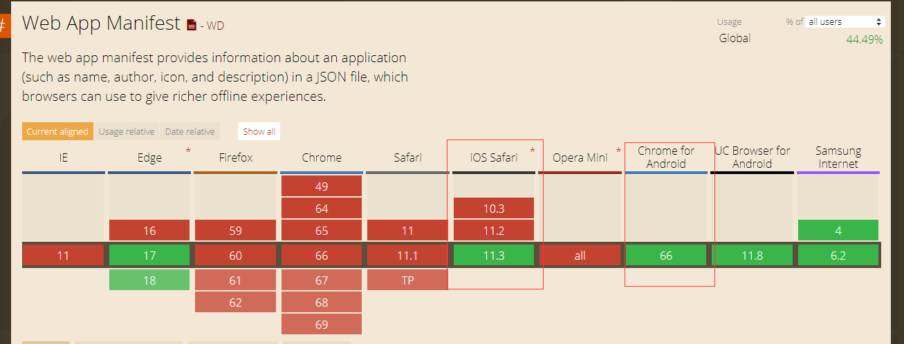
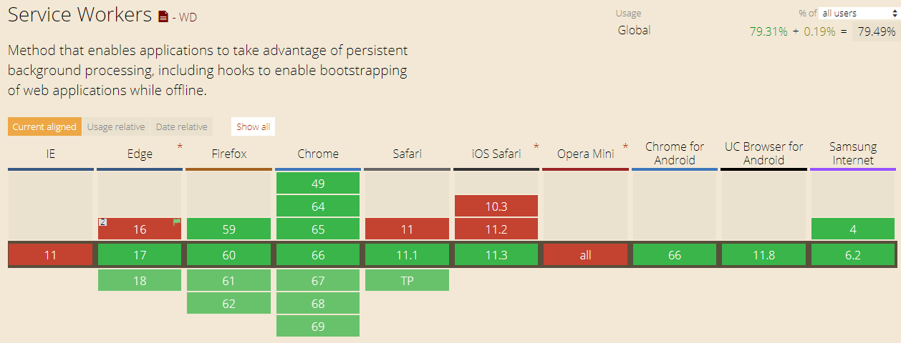
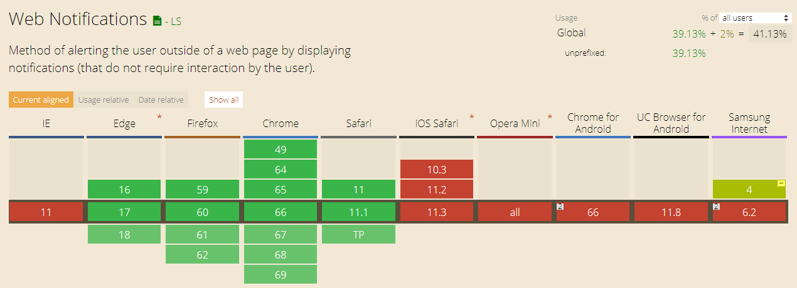
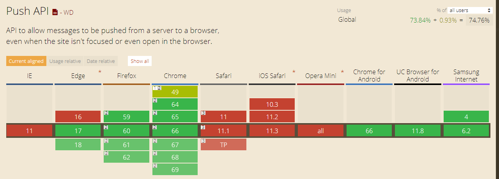
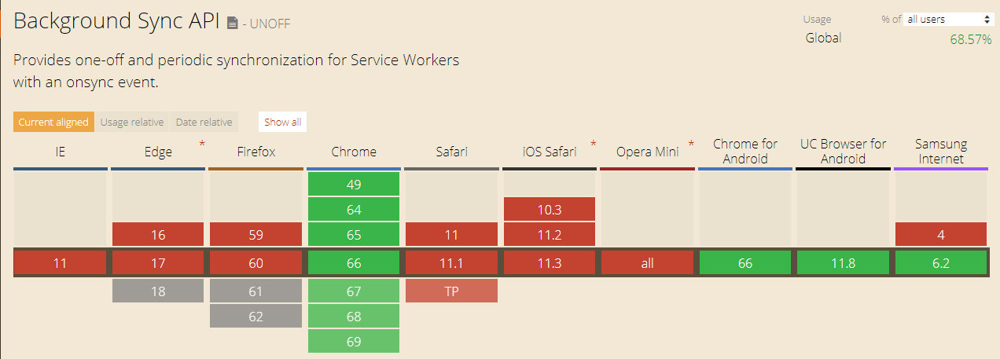

# pwa版cnode

## 什么是 PWA
Progressive Web App, 简称 PWA，是提升 Web App 的体验的一种新方法，能给用户原生应用的体验。</br>
PWA 本质上是 Web App，借助一些新技术也具备了 Native App 的一些特性，兼具 Web App 和 Native App 的优点。</br>
PWA 的主要特点包括下面三点：</br>
* 可靠 - 即使在不稳定的网络环境下，也能瞬间加载并展现</br>
* 体验 - 快速响应，并且有平滑的动画响应用户的操作</br>
* 粘性 - 像设备上的原生应用，具有沉浸式的用户体验，用户可以添加到桌面</br>

## 体验
为了保证首屏的加载，我们需要从设计上考虑，在内容请求完成之前，可以优先保证 App Shell 的渲染，做到和 Native App 一样的体验，App Shell 是 PWA 界面展现所需的最小资源。[App Shell](https://developers.google.cn/web/fundamentals/architecture/app-shell)

## 粘性
* PWA 是可以安装的，用户点击安装到桌面后，会在桌面创建一个 PWA 应用，并且不需要从应用商店下载</br>
* PWA 可以借助 Web App Manifest 提供给用户和 Native App 一样的沉浸式体验</br>
* PWA 可以通过给用户发送离线通知，让用户回流</br>
Web App Manifest 允许开发者控制 PWA 添加到桌面，允许定制桌面图标、URL等等。</br>
参考 [Web App Manifest](https://developers.google.cn/web/fundamentals/web-app-manifest/?hl=zh-cn) 和 [Push Notification](https://developers.google.cn/web/fundamentals/push-notifications/?hl=zh-cn)。

## PWA 改造的成本
从改造的成本考虑，我们也建议采取渐进式的方式，可以考虑按照下面的步骤来改造：</br>
* 第一步，应该是安全，将全站 HTTPS 化，因为这是 PWA 的基础，没有 HTTPS，就没有 Service Worker</br>
* 第二步，应该是 Service Worker 来提升基础性能，离线提供静态文件，把用户首屏体验提升上来</br>
* 第三步，App Manifest，这一步可以和第二步同时进行</br>
* 后续，再考虑其他的特性，离线消息推送等</br>

## 标准的支持度
目前android chrome和ios safari都已经支持service worker，具体看下 Can I use 的统计（包括 PC 和 Mobile）</br>
* App Manifest 的支持度达到 44.49%

* Service Worker 的支持度达到 79.49%

* Notifications API 的支持度达到 41.13%

* Push API 的支持度达到 74.76%

* Background Sync 的支持度达到 68.75%


## 什么是 Service Worker
W3C 组织早在 2014 年 5 月就提出过 Service Worker 这样的一个 HTML5 API ，主要用来做持久的离线缓存。

Service Worker 有以下功能和特性：

* **一个独立的 worker 线程**，独立于当前网页进程，有自己独立的 worker context。
* 一旦被 install，就永远存在，除非被 uninstall
* 需要的时候可以直接唤醒，不需要的时候自动睡眠（有效利用资源，此处有坑）
* 可编程拦截代理请求和返回，缓存文件，缓存的文件可以被网页进程取到（包括网络离线状态）
* 离线内容开发者可控
* 能向客户端推送消息
* 不能直接操作 DOM
* 出于安全的考虑，**必须在 HTTPS 环境下才能工作**
* 异步实现，内部大都是通过 Promise 实现

## 本项目实现的Service Worker
利用`SW Precache Webpack Plugin`（这个插件调用google封装的`https://www.npmjs.com/package/sw-precache`） 插件打包

只支持prdouction环境调试，因为dev环境js代码在内存中，而sw.js必须是物理存在的代码

## `SW Precache Webpack Plugin` 核心代码分析


```javascript
/**
 * sw 生命周期  install
 * 
 * 打包完成的缓存例子
 * precacheConfig = [["index.html", "140fd3370240ba2604f250ce0b8e6bca"], ["static/css/app.1.0.0.1114f9637169215669e03aee5f83c313.css", "a85b5be67746bfe556037088788190cd"], ["static/js/app.1.0.0.1261c0fdb1a07c64df1a.js", "432cd0642f48130c70f618597088bd38"], ["static/js/manifest.1.0.0.08c955c6271b2de14558.js", "88412f28573966e60328beb8ccf632f9"], ["static/js/vendor.1.0.0.bfa4f3d3f29b1ee2f53e.js", "bc23156885d65b8b3b2ace93bf99e6bc"]]
 * 静态资源的绝对路径absoluteUrl对应一个  唯一key cacheKey
 * 
 * 监听 service worker 的 install 事件
 *  service worker 已经安装成功的话，就会调用 event.waitUntil 回调函数
 * caches.open() 方法来创建了一个新的缓存, 在缓存中判断每一个静态资源的绝对路径是否有一个对应的cacheKey，如果没有
 * 则调用cache.put 方法缓存该资源
 * 
 * 当sw.js内容有更新 ，希望在有了新版本时，所有的页面都得到及时自动更新，可以在 install 事件中执行 self.skipWaiting() 
 * 方法跳过 waiting 状态，然后会直接进入 activate 阶段
 */
self.addEventListener('install', function(event) {
  event.waitUntil(
    caches.open(cacheName).then(function(cache) {
      return setOfCachedUrls(cache).then(function(cachedUrls) {
        return Promise.all(
          Array.from(urlsToCacheKeys.values()).map(function(cacheKey) {
            // If we don't have a key matching url in the cache already, add it.
            if (!cachedUrls.has(cacheKey)) {
              var request = new Request(cacheKey, {credentials: 'same-origin'});
              return fetch(request).then(function(response) {
                // Bail out of installation unless we get back a 200 OK for
                // every request.
                if (!response.ok) {
                  throw new Error('Request for ' + cacheKey + ' returned a ' +
                    'response with status ' + response.status);
                }

                return cleanResponse(response).then(function(responseToCache) {
                  return cache.put(cacheKey, responseToCache);
                });
              });
            }
          })
        );
      });
    }).then(function() {
      <% if (skipWaiting) { %>
      // Force the SW to transition from installing -> active state
      return self.skipWaiting();
      <% } %>
    })
  );
});

/**
 * sw 生命周期 激活( activate )
 * event.waitUntil  里delete没有用到的旧资源
 * self.clients.claim()  这样之后打开页面都会使用版本更新的缓存
 */
self.addEventListener('activate', function(event) {
  var setOfExpectedUrls = new Set(urlsToCacheKeys.values());

  event.waitUntil(
    caches.open(cacheName).then(function(cache) {
      return cache.keys().then(function(existingRequests) {
        return Promise.all(
          existingRequests.map(function(existingRequest) {
            if (!setOfExpectedUrls.has(existingRequest.url)) {
              return cache.delete(existingRequest);
            }
          })
        );
      });
    }).then(function() {
      <% if (clientsClaim) { %>
      return self.clients.claim();
      <% } %>
    })
  );
});

/**
 * 监听fetch 事件
 * handleFetch default true
 * 
 * shouldRespond 是否需要劫持我们的 HTTP 响应
 * 排除所有需要忽略的地址并且地址在我们的缓存中，则需要劫持
 * 
 * 
 * 这里只缓存静态资源，一般性的请求没被缓存
 * 
 */
<% if (handleFetch) { %>
self.addEventListener('fetch', function(event) {
  if (event.request.method === 'GET') {
    // Should we call event.respondWith() inside this fetch event handler?
    // This needs to be determined synchronously, which will give other fetch
    // handlers a chance to handle the request if need be.
    var shouldRespond;

    // First, remove all the ignored parameters and hash fragment, and see if we
    // have that URL in our cache. If so, great! shouldRespond will be true.
    var url = stripIgnoredUrlParameters(event.request.url, ignoreUrlParametersMatching);
    shouldRespond = urlsToCacheKeys.has(url);

    // If shouldRespond is false, check again, this time with 'index.html'
    // (or whatever the directoryIndex option is set to) at the end.
    var directoryIndex = '<%= directoryIndex %>';
    if (!shouldRespond && directoryIndex) {
      url = addDirectoryIndex(url, directoryIndex);
      shouldRespond = urlsToCacheKeys.has(url);
    }

    // If shouldRespond is still false, check to see if this is a navigation
    // request, and if so, whether the URL matches navigateFallbackWhitelist.
    var navigateFallback = '<%= navigateFallback %>';
    if (!shouldRespond &&
        navigateFallback &&
        (event.request.mode === 'navigate') &&
        isPathWhitelisted(<%= navigateFallbackWhitelist %>, event.request.url)) {
      url = new URL(navigateFallback, self.location).toString();
      shouldRespond = urlsToCacheKeys.has(url);
    }

    // If shouldRespond was set to true at any point, then call
    // event.respondWith(), using the appropriate cache key.
    if (shouldRespond) {
      event.respondWith(
        caches.open(cacheName).then(function(cache) {
          return cache.match(urlsToCacheKeys.get(url)).then(function(response) {
            if (response) {
              return response;
            }
            throw Error('The cached response that was expected is missing.');
          });
        }).catch(function(e) {
          // Fall back to just fetch()ing the request if some unexpected error
          // prevented the cached response from being valid.
          console.warn('Couldn\'t serve response for "%s" from cache: %O', event.request.url, e);
          return fetch(event.request);
        })
      );
    }
  }
});

```